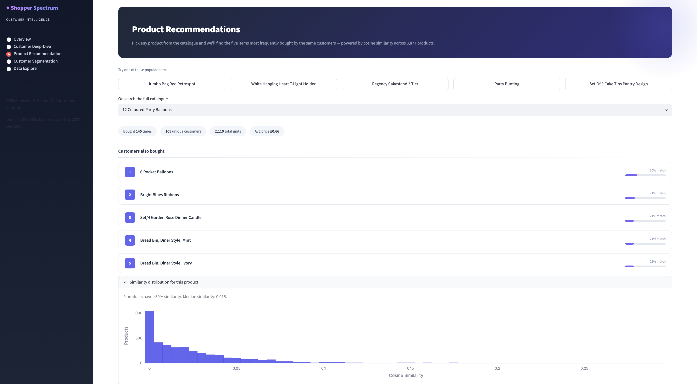
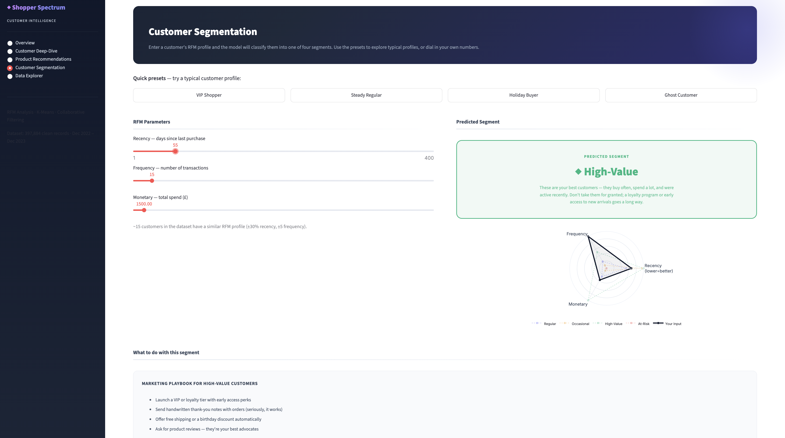
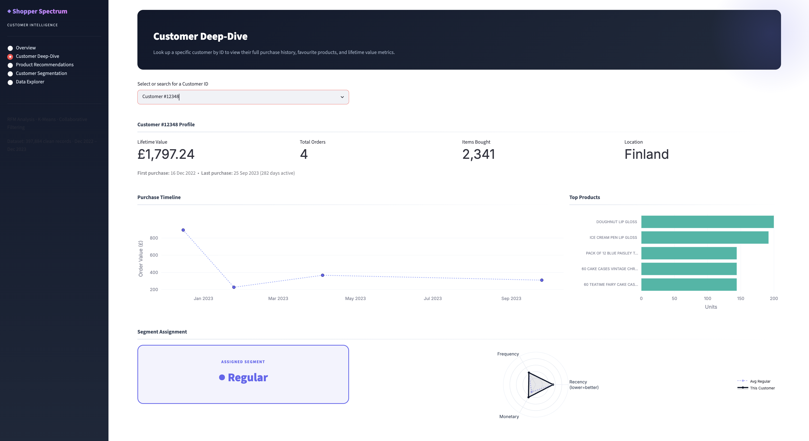

# 🛒 Shopper Spectrum: Customer Segmentation & Product Recommendation System

An end-to-end E-Commerce Analytics project that leverages **RFM Analysis**, **K-Means Clustering**, and **Collaborative Filtering** to identify customer segments and provide personalized product recommendations.

The project helps businesses understand customer purchasing behavior, improve marketing strategies, increase customer retention, and enhance product discovery through intelligent recommendations.


---

🌐 **Live Demo:** **[Try it live here] (https://huggingface.co/spaces/Alvira-14/Shopper_Spectrum)**

---

## 📸 Screenshots

### Product Recommendation Module



### Customer Segmentation Module



### Customer Cluster Visualization



### Top Selling Products Analysis


---

## 🔍 Problem Statement

Modern e-commerce platforms generate massive amounts of transaction data every day. Businesses often struggle to understand customer purchasing behavior and recommend relevant products effectively.

Traditional marketing approaches treat all customers similarly, leading to reduced engagement and lower conversion rates.

This project aims to answer:

**How can customer transaction data be used to segment customers and provide personalized product recommendations?**

---

## 🧠 Project Workflow

```text
📂 Online Retail Dataset
        ↓
🧹 Data Cleaning & Preprocessing
        ↓
📊 Exploratory Data Analysis
        ↓
💰 RFM Feature Engineering
   ├── Recency
   ├── Frequency
   └── Monetary
        ↓
📈 Data Transformation
        ↓
⚙️ Feature Scaling
        ↓
🤖 K-Means Clustering
        ↓
👥 Customer Segmentation
        ↓
🛍️ Collaborative Filtering
        ↓
🎯 Product Recommendations
        ↓
🚀 Streamlit Deployment
```

---

## 📁 Project Structure

```text
Shopper_Spectrum/
│
├── app/
│   └── app.py
│
├── data/
│   └── online_retail.csv
│
├── models/
│   ├── customer_segmentation_model.pkl
│   ├── product_similarity.pkl
│   └── scaler.pkl
│
├── notebooks/
│   └── Shopper_Spectrum.ipynb
│
├── requirements.txt
├── README.md
│
└── Screenshots/
    ├── recommendation.png
    ├── segmentation.png
    ├── clusters.png
    └── products.png
```

---

## 📊 Dataset

The project uses the Online Retail Dataset containing transactions from a UK-based online retail store.

### Features

| Column      | Description         |
| ----------- | ------------------- |
| InvoiceNo   | Invoice Number      |
| StockCode   | Product Code        |
| Description | Product Name        |
| Quantity    | Quantity Purchased  |
| InvoiceDate | Purchase Date       |
| UnitPrice   | Product Price       |
| CustomerID  | Customer Identifier |
| Country     | Customer Country    |

### Dataset Statistics

* Original Records: 541,909+
* Records After Cleaning: 392,000+
* Unique Customers: 4,338
* Unique Products: 3,877
* Countries Covered: 30+

---

## ⚙️ Data Preprocessing

The following preprocessing steps were performed:

* Removed duplicate transactions
* Removed missing Customer IDs
* Excluded cancelled invoices
* Removed invalid quantities and prices
* Converted InvoiceDate to datetime format
* Created TotalPrice feature

### Total Revenue Formula

```python
df["TotalPrice"] = df["Quantity"] * df["UnitPrice"]
```

---

## 📈 Exploratory Data Analysis

Several business insights were extracted:

### Country Analysis

* United Kingdom dominates total transactions.
* European countries contribute significantly to sales volume.

### Product Analysis

Top-selling products include:

* PAPER CRAFT , LITTLE BIRDIE
* MEDIUM CERAMIC TOP STORAGE JAR
* WORLD WAR 2 GLIDERS ASSTD DESIGNS
* JUMBO BAG RED RETROSPOT

### Revenue Analysis

* Revenue distribution is highly right-skewed.
* Small group of customers contributes major revenue.

---

## 💰 RFM Analysis

Customer behavior was analyzed using:

### Recency (R)

Number of days since customer's last purchase.

### Frequency (F)

Number of transactions made by the customer.

### Monetary (M)

Total amount spent by the customer.

### Example

| Customer | Recency | Frequency | Monetary |
| -------- | ------- | --------- | -------- |
| A        | 10      | 250       | 6000     |
| B        | 180     | 5         | 300      |

---

## 🤖 Customer Segmentation

### Clustering Algorithm

K-Means Clustering

### Feature Processing

* Log Transformation
* StandardScaler Normalization
* Elbow Method
* Silhouette Score Analysis

### Optimal Clusters

K = 4

### Customer Segments

| Segment    | Characteristics                 |
| ---------- | ------------------------------- |
| High-Value | Recent, frequent, high spenders |
| Regular    | Consistent customers            |
| Occasional | Moderate purchasing behavior    |
| At-Risk    | Inactive customers              |

---

## 📊 Cluster Insights

### High-Value Customers

* Highest spending behavior
* Frequent purchases
* Recent transactions

### Regular Customers

* Stable purchase patterns
* Moderate spending

### Occasional Customers

* Less frequent purchases
* Moderate engagement

### At-Risk Customers

* Long inactivity period
* Require retention campaigns

---

## 🛍️ Product Recommendation System

The recommendation engine uses:

### Item-Based Collaborative Filtering

Products are recommended based on customer purchase history.

### Similarity Metric

Cosine Similarity

### Workflow

```text
Customer-Product Matrix
          ↓
Cosine Similarity
          ↓
Product Similarity Matrix
          ↓
Top 5 Similar Products
```

### Example Recommendation

Input:

```text
JUMBO BAG RED RETROSPOT
```

Output:

```text
JUMBO BAG STRAWBERRY
JUMBO BAG PINK POLKADOT
JUMBO BAG OWLS
JUMBO BAG PINK VINTAGE PAISLEY
JUMBO BAG APPLES
```

---

## 🖥️ Streamlit Features

### 🛍️ Product Recommendation Module

* Product Search
* Intelligent Product Matching
* Top 5 Recommendations
* User-Friendly Interface

### 👥 Customer Segmentation Module

* Recency Input
* Frequency Input
* Monetary Input
* Real-Time Segment Prediction

### 📊 Interactive Dashboard

* Executive Overview with KPI Cards & Sparklines
* Global Reach Choropleth Map
* Cohort Retention Rate Heatmap
* Sidebar Navigation
* Business-Oriented Insights
* Real-Time Predictions

---

## 🚀 Installation

### Clone Repository

```bash
git clone https://github.com/Alvira-Parveen/Shopper_Spectrum.git

cd Shopper_Spectrum
```

### Install Dependencies

```bash
pip install -r requirements.txt
```

### Run Application

```bash
cd app

streamlit run app.py
```

Open localhost in your browser.

---

## 🛠️ Tech Stack

| Category              | Technology              |
| --------------------- | ----------------------- |
| Language              | Python                  |
| Data Analysis         | Pandas, NumPy           |
| Machine Learning      | Scikit-Learn            |
| Clustering            | K-Means                 |
| Recommendation System | Collaborative Filtering |
| Visualization         | Plotly, Matplotlib, Seaborn |
| Deployment            | Streamlit               |

---

## 📌 Business Impact

This solution helps businesses:

* Improve customer retention
* Identify high-value customers
* Run targeted marketing campaigns
* Increase product discoverability
* Enhance customer experience
* Optimize inventory planning

---

## 🔮 Future Improvements

* Real-Time Recommendation Engine
* Customer Lifetime Value Prediction
* Deep Learning-Based Recommendations
* Personalized Discount Engine
* Customer Churn Prediction
* Cloud Deployment with Streamlit Community Cloud

---

## 👤 Author

**ALVIRA PARVEEN**

🔗 LinkedIn: https://www.linkedin.com/in/alvira-parveen-78022536b

🌐 GitHub: https://github.com/Alvira-Parveen

---

## 📄 License

This project is licensed under the MIT License.

---

⭐ If you found this project useful, consider giving it a star.
